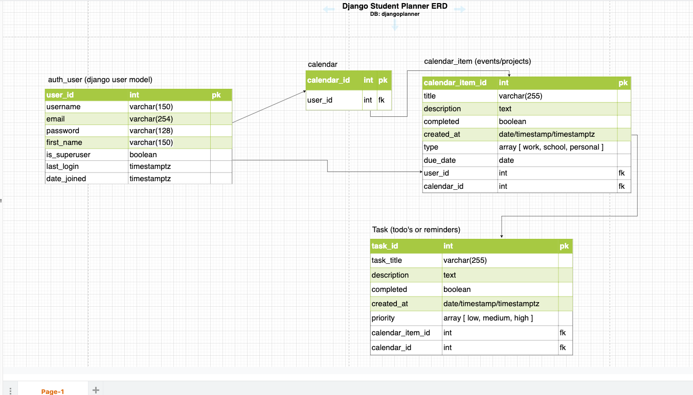
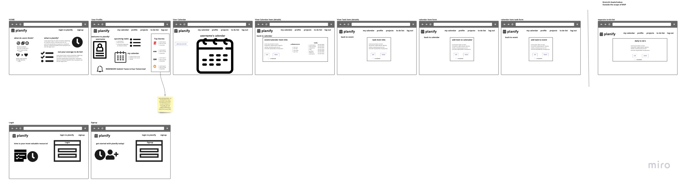
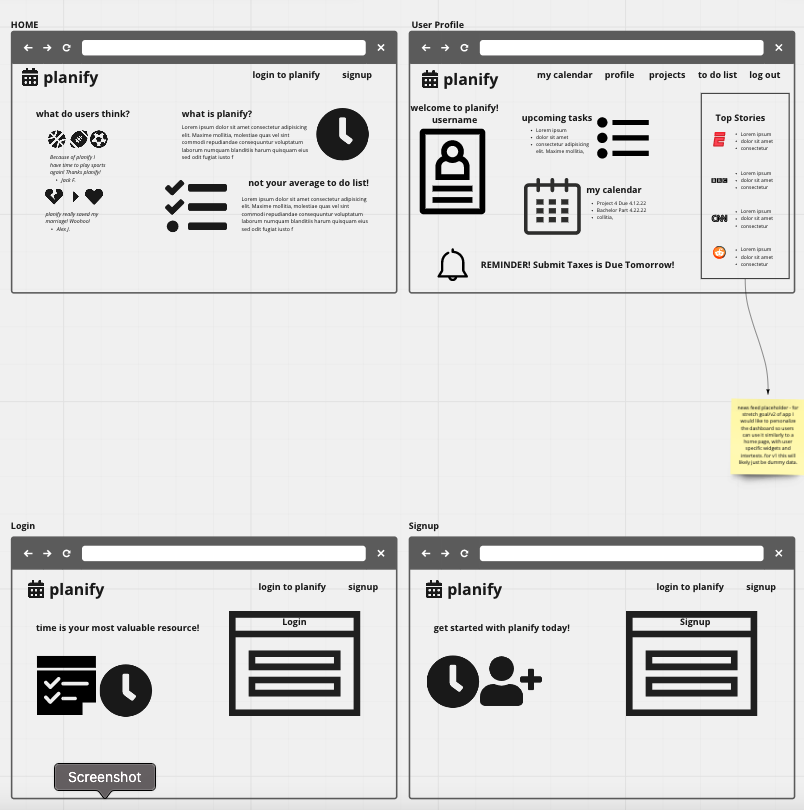
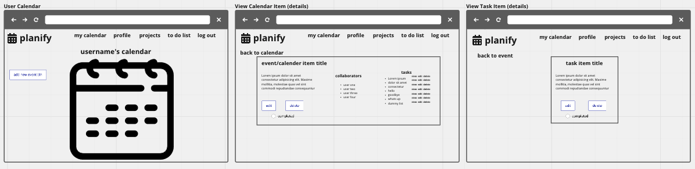
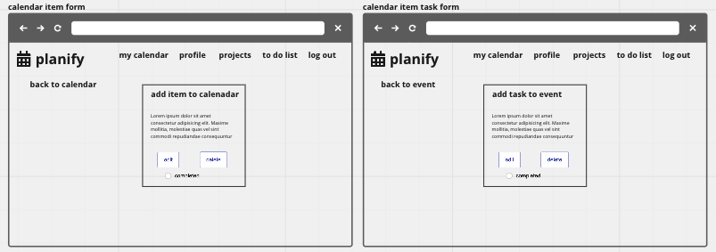

# Django Student Planner

For Project 4 I will be creating a student planner or task planner application. The application is inspired by a simple to-do list, Google Calendar, and a project management system or kanban. Which is something I hope to introduce to everyday users and help them to understand the value of this in everyday life.  

Users will be able to create events or projects and add them to a calendar style project management system. Within this calendar each event/project will open up to a separate event/project management area, where users will be able to edit or delete each project, add a separate to-do list for each task, add reminders, take notes, upload documents and more. I would also like to be able to have users share projects/events and assign one another to different portions of it - but this may be iceboxed for later on. 

# Usage
While its called a student planner by the repo, and this will likely be the iniital scope of the application, I would like this to be used for more than just projects and assignments, but for events and personal planning and daily reminders as well. Whether you are planning a bachelor party for a friend, planning a group trip, or just using it for your daily reminders - this app should work fine. 

## Models/Relationships
1:M - Each user will be able to create many events/projects to their calendar. 
M:M - Each event/project has collaborators or team members.

# Pre-Planning

## Original ERD
As the project wore on I deviated from the inital ERD as I realized it worked better for the project, and the actual functionality. In addition, there were many more models that needed to be added such as Profile, as well as the add-on features like the NewsletterEmail and Contact Form.

## User Stories
- As a user I should be able to create an account - using some type of a username/email and password. 
- AAU I should be able to login with that account.
- AAU I should be able to view the profile page.
- AAU I should be able to view my own user-specific calendar.
- AAU I should be able to add events to my calendar.
- AAU I should be able to see those events in a list view as well.
- AAU I should be able to edit those events.
- AAU I should be able to delete that event.
- AAU I should be able to view a specfic details page for that event.
- AAU I should be able to add tasks to that event.
- AAU I should be able to edit tasks from that event.
- AAU I should be able to delete tasks from that event.
- AAU I should be able to add a collaboration team to my events.
- AAU I should be able to delete collaborators.
- AAU I should be able to edit collaborators.
- AAU I should be able to view collaborators and their specific information.

## Wireframes
Similarly to my ERD I deviated from my wireframe a bit throughout the devleopment process, as I found it easier to render the specific items the way I wanted to and it was better for functionality.

Additional Wireframe Images

# What I Would Do Different?
I would absolutely style it better and in future iterations I will definitely be completely revamping the aesthetics and overall appearance of the application. In addition, I had planned on using Bootstrap but I decided not to in the end, but didn't leave myself enough time for styling things the right way. 